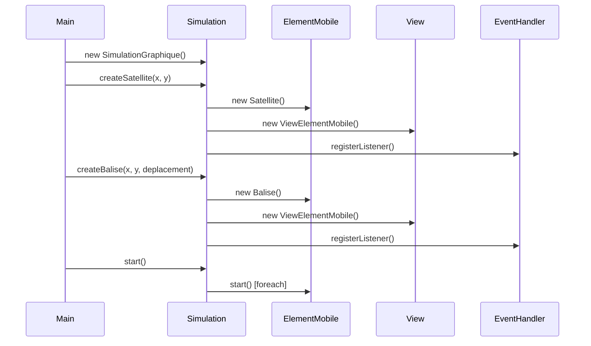
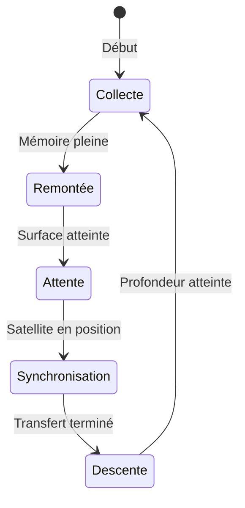
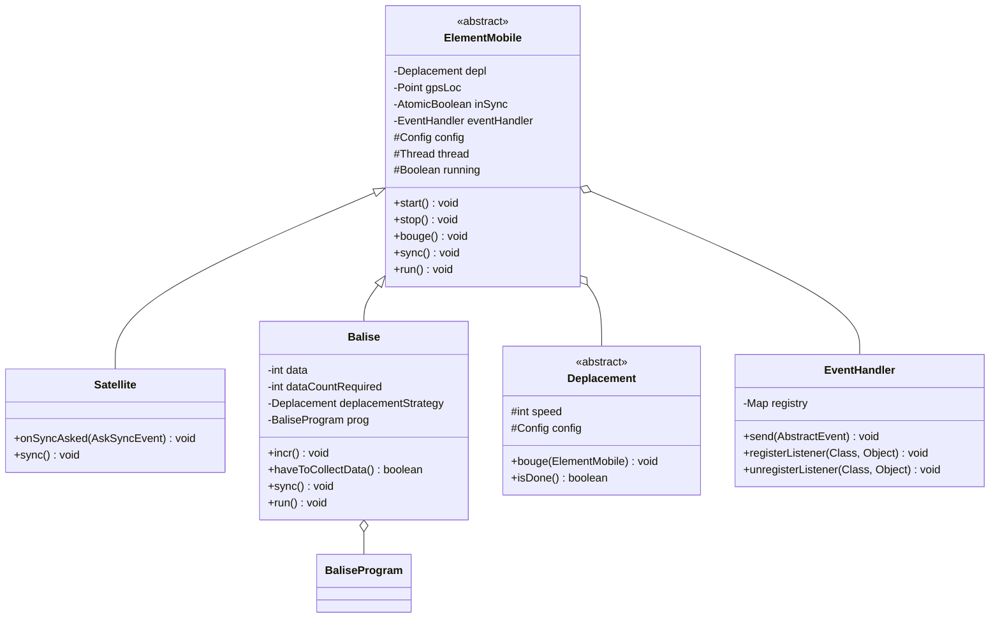
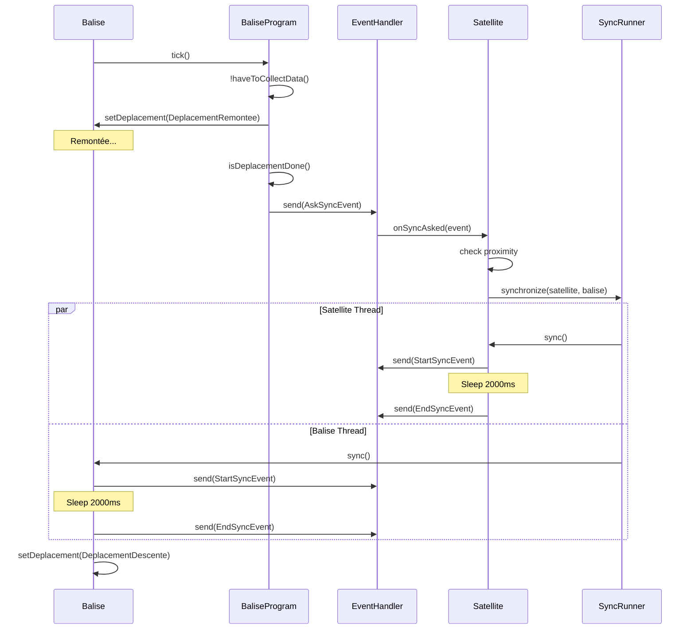
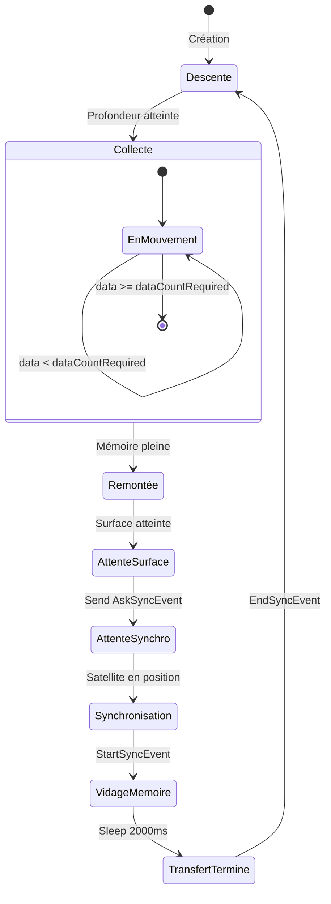

# Documentation Complète - Projet Satellites et Balises

## Table des matières
1. [Vue d'ensemble du projet](#vue-densemble-du-projet)
2. [Architecture générale](#architecture-générale)
3. [Patterns de conception](#patterns-de-conception)
4. [Structure des packages](#structure-des-packages)
5. [Composants principaux](#composants-principaux)
6. [Cycle de vie d'une simulation](#cycle-de-vie-dune-simulation)
7. [Interpréteur de commandes](#interpréteur-de-commandes)
8. [Guide d'utilisation](#guide-dutilisation)
9. [Diagrammes UML](#diagrammes-uml)
10. [Conclusion](#conclusion)

---

## 1. Vue d'ensemble du projet

### 1.1 Contexte
Le projet **Satellites et Balises** est une simulation d'un système de collecte de données océaniques. Une entreprise spécialisée dans l'étude des océans déploie des balises autonomes dans des zones maritimes pour mesurer diverses caractéristiques physiques (température, courants, luminosité, composition du milieu marin).

### 1.2 Objectifs principaux
- **Simulation temps réel** : Modéliser le comportement de balises marines et de satellites
- **Collecte de données** : Les balises collectent des données sous-marines
- **Synchronisation** : Les balises remontent en surface pour transmettre leurs données aux satellites
- **Visualisation** : Interface graphique pour observer la simulation
- **Interactivité** : Langage de script pour contrôler dynamiquement la simulation

### 1.3 Technologies utilisées
- **Java 17** : Langage principal
- **Gradle** : Système de build
- **ANTLR 4** : Génération de l'analyseur syntaxique pour l'interpréteur
- **Swing/AWT avec Nicellipse** : Interface graphique
- **ClassGraph** : Scanning dynamique des packages
- **Multithreading** : Gestion concurrente des éléments mobiles

---

## 2. Architecture générale

### 2.1 Architecture MVC (Model-View-Controller)

L'application suit une architecture MVC stricte :

#### **Model** (`com.ubo.paco.model`)
- `ElementMobile` : Classe abstraite pour tous les éléments mobiles
- `Satellite` : Représente un satellite orbital
- `Balise` : Représente une balise océanique
- Gestion des états et des données

#### **View** (`com.ubo.paco.view`, `com.ubo.paco.graphicsElement`)
- `ViewElementMobile` : Vue graphique des éléments
- `ViewHeadless` : Vue console (logs)
- Composants graphiques personnalisés (NiBalise, NiSatellite, etc.)

#### **Controller** (`com.ubo.paco.simulation`)
- `Simulation` : Interface principale de contrôle
- `SimulationGraphique` : Implémentation avec interface graphique
- `SimulationHeadless` : Implémentation sans interface graphique

### 2.2 Architecture en couches

```
┌─────────────────────────────────────────┐
│         Interface utilisateur           │
│  (Swing GUI / Console / Interpréteur)   │
├─────────────────────────────────────────┤
│           Couche Simulation             │
│    (Orchestration, Factory, DSL)        │
├─────────────────────────────────────────┤
│          Couche Événements              │
│    (Observer, Event Handler, Bus)       │
├─────────────────────────────────────────┤
│           Couche Modèle                 │
│  (ElementMobile, Balise, Satellite)     │
├─────────────────────────────────────────┤
│        Couche Infrastructure            │
│  (Config, Threading, Déplacements)      │
└─────────────────────────────────────────┘
```

---

## 3. Patterns de conception

### 3.1 Pattern Strategy

Le pattern stratégie est utilisé pour définir les modes de déplacement des éléments mobiles (balise et satellite).
Chaque objet de type déplacement dispose d'une méthode `bouge` qui met à jour la position de l'élément mobile, et d'une méthode `isDone` qui indique si le déplacement est terminé.

La méthode `isDone` retourne false par défaut, car seuls certains déplacement peuvent finir : ceux de descente et de remontée par exemple.

#### Implémentation
```java
// Interface/Classe abstraite
public abstract class Deplacement {
    protected int speed;
    protected Config config;
    
    public abstract void bouge(ElementMobile elementMobile);
    public boolean isDone() { return false; }
}
```

#### Stratégies concrètes
- `DeplacementHorizontal` : Mouvement horizontal avec wrap-around
- `DeplacementSinusoide` : Mouvement sinusoïdal
- `DeplacementImmobile` : Aucun mouvement
- `DeplacementDescente` : Descente verticale jusqu'à une profondeur
- `DeplacementRemontee` : Remontée à la surface
- `DeplacementAutonome` : Changement dynamique de stratégie au cours de la simulation

Le pattern stratégie est aussi utilisé par la balise pour son programme (objet `BaliseProgram`).
En effet, nous avons souhaité disposer de la possibilité de changer le cycle d'opérations effectué par une balise (descente -> collecte de données -> remontée -> synchro).
Ce cycle est le cycle par défaut (cf. `DefaultBaliseProgram`), mais nous pourrions créer d'autres fonctionnements pour la balise à l'aide d'autres sous classes de `BaliseProgram`.

La configuration de la simulation (`Config` et `DefaultConfig`) utilise aussi ce pattern.

### 3.2 Pattern Observer

Les éléments mobiles communiquent entre eux et avec leurs vues grâce à un mécanisme d'événements.
Un EventHandler permet d'abonner des objets aux notifications d'un type d'événement émises par l'objet qui possède ce handler.

#### Architecture événementielle
```java
public class EventHandler {
    Map<Class<? extends AbstractEvent>, Set<Object>> registry;
    
    public void send(AbstractEvent event) {
        // Notifie tous les listeners enregistrés
    }
    
    public void registerListener(Class<?> eventType, Object listener) {
        // Enregistre un listener pour un type d'événement
    }
}
```

```java
public abstract class AbstractEvent extends EventObject {
    public AbstractEvent(Object source) {
        super(source);
    }

    public abstract void sendTo(Object target);
    
}
```

#### Types d'événements
- `MoveEvent` : Notification de déplacement
- `StartSyncEvent` : Début de synchronisation
- `EndSyncEvent` : Fin de synchronisation
- `AskSyncEvent` : Demande de synchronisation balise→satellite

### 3.3 Pattern Visitor

Pour parcourir l'arbre généré par le parseur ANTLR et instancier les objets de la simulation, nous utilisons un visiteur.

```java
public class SimulationVisitor extends SatelliteLangBaseVisitor<Object> {
    // Visite chaque nœud de l'AST et exécute l'action correspondante
}
```

---

## 4. Structure des packages

### 4.1 Organisation hiérarchique

```
com.ubo.paco/
├── config/                  # Configuration système
│   ├── Config.java          # Interface de configuration
│   └── DefaultConfig.java   # Configuration par défaut
│
├── deplacement/             # Stratégies de déplacement
│   ├── Deplacement.java     # Classe abstraite
│   ├── DeplacementHorizontal.java
│   ├── DeplacementSinusoide.java
│   ├── DeplacementImmobile.java
│   ├── DeplacementDescente.java
│   ├── DeplacementRemontee.java
│   └── DeplacementAutonome.java
│
├── events/                  # Système d'événements
│   ├── AbstractEvent.java
│   ├── EventHandler.java
│   ├── MoveEvent.java
│   ├── StartSyncEvent.java
│   ├── EndSyncEvent.java
│   ├── AskSyncEvent.java
│   └── ViewEventReceiver.java
│
├── model/                   # Modèle de données
│   ├── ElementMobile.java
│   ├── Satellite.java
│   ├── Balise.java
│   └── baliseprogram/       # Comportement des balises
│       ├── BaliseProgram.java
│       └── DefaultBaliseProgram.java
│
├── view/                    # Vues
│   ├── ViewElementMobile.java
│   └── ViewHeadless.java
│
├── graphicsElement/         # Composants graphiques
│   ├── NiBalise.java
│   ├── NiSatellite.java
│   ├── NiSea.java
│   ├── NiSky.java
│   ├── NiSync.java
│   └── PositionStrategy/
│       ├── PositionStrategy.java
│       └── CenterPositionStrategy.java
│
├── simulation/              # Contrôleurs de simulation
│   ├── Simulation.java
│   ├── SimulationGraphique.java
│   └── SimulationHeadless.java
│
├── interpreteur/            # Interpréteur de commandes
│   └── SimulationVisitor.java
│
└── ThreadRunner/            # Gestion du multithreading
    └── SyncRunner.java
```

### 4.2 Packages externes

```
simulation.antlr4/           # Code généré par ANTLR
├── SatelliteLangLexer.java
├── SatelliteLangParser.java
└── SatelliteLangBaseVisitor.java

nicellipse.component/        # Bibliothèque graphique
├── NiBasicComponent.java
├── NiRectangle.java
├── NiSpace.java
└── ...
```

---

## 5. Composants principaux

### 5.1 ElementMobile

**Responsabilités** :
- Position GPS (Point)
- Déplacement (Strategy pattern)
- Thread d'exécution
- Gestion des événements
- État de synchronisation

**Caractéristiques clés** :
```java
public class ElementMobile implements Runnable {
    private Deplacement depl;
    private Point gpsLoc;
    private AtomicBoolean inSync;
    private EventHandler eventHandler;
    protected Thread thread;
    protected Boolean running;
    
    public void start() { /* Démarre le thread */ }
    public void stop() { /* Arrête le thread */ }
    public void bouge() { /* Applique le déplacement */ }
    public void sync() { /* Processus de synchronisation */ }
}
```

### 5.2 Balise

La balise est un élément mobile auquel on rajoute le comportement de collecte de données.

**Cycle de vie** :
1. **Phase de collecte** : Plongée et collecte de données sous-marines
2. **Phase de remontée** : Remontée à la surface quand la mémoire est pleine
3. **Phase de synchronisation** : Attente et transfert des données vers un satellite
4. **Phase de redescente** : Retour en profondeur pour un nouveau cycle

**Attributs spécifiques** :
- `data` : Nombre de données collectées
- `dataCountRequired` : Capacité mémoire (aléatoire entre min et max)
- `deplacementStrategy` : Stratégie de déplacement sous l'eau
- `prog` : Programme comportemental (BaliseProgram)

### 5.3 Satellite

**Comportement** :
- Déplacement orbital horizontal continu
- Vitesse variable (peut être géostationnaire)
- Répond aux demandes de synchronisation des balises
- Ralentit pendant la synchronisation

**Méthode clé** :
```java
public void onSyncAsked(AskSyncEvent event) {
    Balise balise = event.getBalise();
    if (!this.getInSync() && !balise.getInSync()) {
        if (Math.abs(satelliteX - baliseX) <= config.getSyncWindowSize()) {
            runner.synchronize(this, balise);
        }
    }
}
```

### 5.4 Configuration

**Paramètres par défaut** :
- **Dimensions** : Fenêtre (1280x720), niveau mer (360px)
- **Données à collecter** : entre Min (10), Max (30) données par cycle de balise
- **Synchronisation** : Fenêtre (50px), Durée (2000ms)
- **Animation** : Intervalle entre chaque déplacement (50ms)
- **Vitesses** : Linéaire (4px), Variable (2-5px)

---

## 6. Cycle de vie d'une simulation

### 6.1 Initialisation



### 6.2 Boucle principale d'exécution

#### Thread Balise
```java
while (running) {
    // 1. Collecte de données
    if (runnerCount % dataCollectionFrequency == 0 && haveToCollectData()) {
        incr();
    }
    
    // 2. Exécution du programme comportemental
    prog.tick(); // Gère les transitions d'état
    
    // 3. Mise à jour de la position et notification
    makeFrame(); // bouge() + send(MoveEvent) + sleep()
}
```

#### Thread Satellite
```java
while (running) {
    makeFrame(); // bouge() + send(MoveEvent) + sleep()
}
```

### 6.3 Processus de synchronisation



**Détail du processus** :

1. **Détection** : La balise remonte et envoie `AskSyncEvent`
2. **Vérification** : Le satellite vérifie la proximité (±50px)
3. **Synchronisation** : 
   - Les deux éléments passent en mode `inSync`
   - Envoi de `StartSyncEvent`
   - Thread.sleep(2000ms)
   - Envoi de `EndSyncEvent`
4. **Reprise** : Chaque élément reprend son comportement normal

---

## 7. Interpréteur de commandes

### 7.1 Grammaire ANTLR

**Syntaxe du langage** :

```antlr
program : statement* EOF ;

statement 
    : assignStmt ';'        // var := expr
    | methodCall ';'        // obj.method(args)
    | COMMENT              // // commentaire
    ;

assignStmt : ID ':=' expr ;

methodCall : ID '.' ID '(' argList? ')' ;

expr 
    : NUMBER               // 42, 3.14
    | STRING               // "texte"
    | HASHWORD             // #horizontal
    | ID                   // variable
    | instantiation        // new Class(args)
    | methodCall           // obj.method()
    ;

instantiation : 'new' ID '(' argList? ')' ;
```

### 7.2 Exemples de scripts

```javascript
// Création d'une simulation graphique
sim1 := new SimulationGraphique();

// Création d'un satellite à 2000m d'altitude
sat1 := sim1.createSatellite(x = 640, y = 200);

// Création de balises avec différents déplacements
b1 := sim1.createBalise(x = 100, y = 400, deplacement = "horizontal");
b2 := sim1.createBalise(x = 300, y = 450, deplacement = "sinusoidal");
b3 := sim1.createBalise(x = 500, y = 500, deplacement = "immobile");

// Démarrage de la simulation
sim1.start();

// Arrêt de la simulation
sim1.stop();
```

### 7.3 Architecture du Visitor

**SimulationVisitor** :
- Parcourt l'AST généré par ANTLR
- Résolution dynamique des classes via ClassGraph
- Gestion des variables dans une HashMap
- Conversion automatique des types
- Invocation réflexive des méthodes

**Fonctionnalités avancées** :
- Recherche de classes dans plusieurs packages
- Création d'instances avec constructeurs ou setters
- Support des méthodes chaînées
- Gestion des types numériques (int, double, float)

---

## 8. Examples d'usage
### 8.1 Lancement standard

```java
public class Main {
    public static void main(String[] args) {
        // Configuration
        Config config = new DefaultConfig();
        
        // Création de la simulation
        Simulation simulation = new SimulationGraphique(config);
        
        // Ajout d'éléments
        simulation.createSatellite(640, 100);
        simulation.createBalise(200, 400, "horizontal");
        simulation.createBalise(400, 450, "sinusoidal");
        
        // Démarrage
        simulation.start();
    }
}
```

### 8.2 Mode interpréteur

```java
public class MainInterpreteur {
    public static void main(String[] args) {
        Scanner scanner = new Scanner(System.in);
        SimulationVisitor visitor = new SimulationVisitor("java.awt");
        
        while (true) {
            System.out.print("> ");
            String input = scanner.nextLine();
            
            // Parse et exécute la commande
            CharStream charStream = CharStreams.fromString(input);
            SatelliteLangLexer lexer = new SatelliteLangLexer(charStream);
            CommonTokenStream tokens = new CommonTokenStream(lexer);
            SatelliteLangParser parser = new SatelliteLangParser(tokens);
            
            var tree = parser.statement();
            Object result = visitor.visit(tree);
        }
    }
}
```

### 8.3 Mode headless (sans GUI)

```java
Simulation simulation = new SimulationHeadless(config);
// Même API que SimulationGraphique mais avec logs console
```

---

## 9. Diagrammes UML

### 9.1 Diagramme de classes principal



### 9.2 Diagramme de séquence - Synchronisation



### 9.3 Diagramme d'états - Balise



---

## 10. Conclusion

Le projet **Satellites et Balises** représente une implémentation sophistiquée d'une simulation temps réel utilisant les meilleures pratiques de conception orientée objet. L'architecture modulaire, l'utilisation judicieuse des design patterns et la séparation claire des responsabilités permettent une maintenance facile et des extensions futures sans impact majeur sur le code existant.

Les points forts du projet incluent :
- **Architecture MVC** claire et bien structurée
- **Patterns de conception** utilisés à bon escient (Strategy, Observer, Visitor)
- **Multithreading** robuste avec gestion de la concurrence
- **Interpréteur de commandes** flexible basé sur ANTLR
- **Double mode** de visualisation (GUI/Headless)
- **Configuration** centralisée et extensible

Le système est prêt pour la production et peut facilement être étendu pour supporter de nouvelles fonctionnalités.
[JavaDoc](javadoc/index.html)